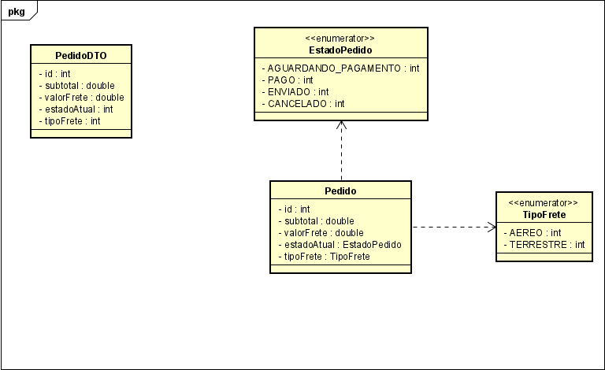
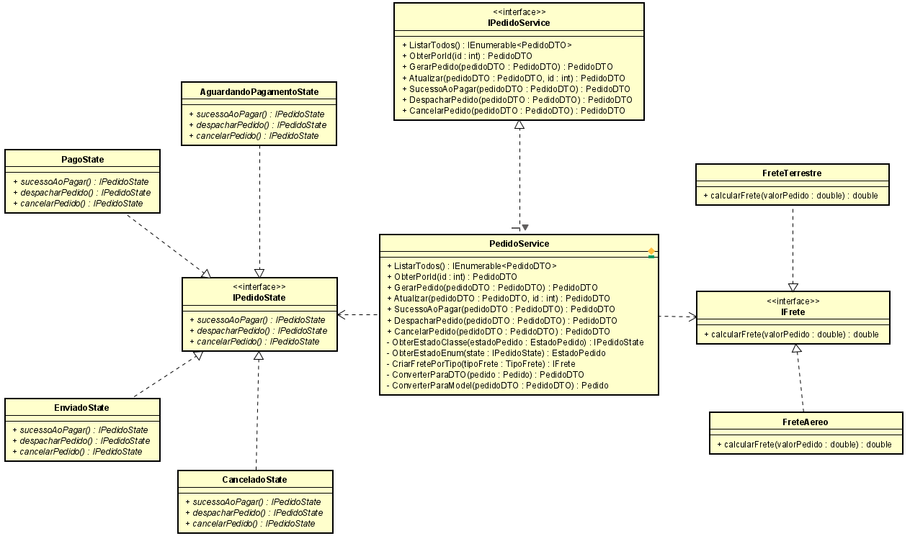

# DesignPatternsProject
Atividade avaliativa de programação referente as aulas de Design Patterns contidas na disciplina Modelagem de Padrões de Projetos. Prof. Jefferson Passerini.
Fatec Prof. José Camargo, Jales-SP.

🛍️ E-commerce API com Aplicação de Design Patterns
📖 Visão Geral

Este projeto consiste no desenvolvimento de uma API para um sistema de e-commerce, com foco no aprendizado e aplicação prática de padrões de projeto (Design Patterns). A solução foi desenhada para gerenciar pedidos e formas de envio, com lógica clara de transição de estados e cálculo de frete.

Diagramas UML

🔧 Funcionalidades Principais

    🎯 Gestão de Pedidos
    Os pedidos percorrem um fluxo de status: Aguardando Pagamento, Pago, Enviado e Cancelado.

    🚚 Tipos de Frete
    Oferece envio via:

        Transporte terrestre (5% do valor do pedido)

        Transporte aéreo (10% do valor do pedido)

    🔒 Restrições de Estado
    Uma vez cancelado, o pedido torna-se imutável — não pode ser alterado nem avançar de status.

    🔁 Extensibilidade
    A estrutura foi projetada para permitir inclusão de novos métodos de frete ou status sem afetar o funcionamento atual do sistema.

🧠 Padrões de Projeto Utilizados
🌀 State Pattern

Controla o ciclo de vida do pedido, encapsulando cada estado como uma classe específica. Define as operações válidas em cada etapa e bloqueia ações inválidas, promovendo robustez e clareza.
📐 Strategy Pattern

Permite aplicar diferentes estratégias de cálculo de frete com base no tipo de envio selecionado. O cálculo é isolado por estratégia, promovendo a adesão ao princípio Open/Closed.
🧱 Arquitetura e Camadas

O sistema é desenvolvido como uma API RESTful utilizando ASP.NET Core com persistência em PostgreSQL. As responsabilidades são organizadas em camadas bem definidas:
📂 Repository

Responsável pelo acesso aos dados e comunicação com o banco. Essa camada isola a lógica de persistência e facilita testes e manutenções.
⚙️ Service

Contém a regra de negócio, incluindo:

    Gerenciamento de pedidos

    Cálculo de frete

    Transição entre estados

    Conversões entre Model e DTO

Aqui também é onde os padrões State e Strategy são aplicados.
🌐 Controller

A interface entre o cliente e o sistema. Os controladores expõem os endpoints, validam as requisições e delegam o processamento para os serviços.
🧪 Exemplos de Fluxo

    Criar pedido: inicia com estado Aguardando Pagamento.

    Pagar pedido: transita para Pago.

    Enviar pedido: transita para Enviado.

    Cancelar pedido: transita para Cancelado (sem retorno).

💡 Considerações Finais

Este projeto é uma excelente base para praticar conceitos de design orientado a objetos e desenvolvimento em camadas, com ênfase em responsabilidade única, extensibilidade e legibilidade de código.